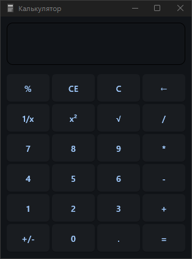

<p align="center">
  
</p>

<h1 align="center" class="outfit-text">
  DeCalc
</h1>

Простой и красивый калькулятор, реализованный с использованием Python и [Flet](https://flet.dev/) — фреймворка для создания GUI-приложений.

<p align="center">
  <a style="text-decoration:none" href="https://github.com/DevNexe/DeCalc/releases">
    
  </a>
</p>

## 🖼️ Интерфейс
Современный пользовательский интерфейс, напоминающий стандартный калькулятор Windows. Приложение поддерживает базовые математические операции, обработку ошибок и ограничение размеров окна.

## 🚀 Возможности

- ➕ Сложение  
- ➖ Вычитание  
- ✖ Умножение  
- ➗ Деление  
- 🧮 Поддержка десятичных дробей  
- 🧾 История вычислений (заготовка)
- ⌫ Удаление последнего символа
- ♻ Сброс ввода  
- ➕/➖ Изменение знака  
- ⚠ Обработка деления на 0 и других ошибок

## 📦 Зависимости

- Python >=3.12
- [Flet](https://pypi.org/project/flet/)

Установить Flet:

```bash
pip install flet
```

## ▶ Запуск

Склонируй репозиторий и запусти:

```bash
python main.py
```
## 📸 Скриншот



## 🛠 Примечания

- Используется decimal.Decimal для точных вычислений.
- Интерфейс фиксированной ширины и высоты (328x430), не изменяется пользователем.
- Поддержка кнопок %, CE, √, 1/x, x² добавлена в интерфейс, но функциональность не реализована — ты можешь доработать.


